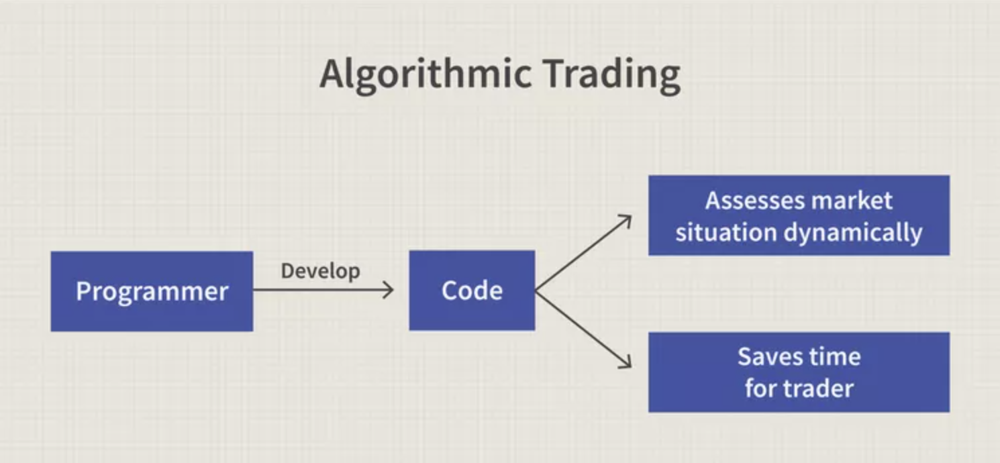

# **Columbia University Engineering, New York FinTech BootCamp** 
# **August 2022 Cohort**


## *Module 14, Challenge -  Data Science & Machine Learning - Algoritmic Trading, Supervised MachineLearning*
Objective - improve existing algorithmic trading system such that a competitive 'edge' is maintained in the market through creation of an algorithmic trading model that learns and adapts to new data and evolving markets.

Scenario - Given a historical dataset CSV file, employ supervised machine learning modeling to evaluate dataset features and create an algorithmic trading model that learns and adapts to new data, improving on existing algorithmic trading system such that a competitive advantage is maintained.  

Product - Jupyter notebook with -

* > Data preprocessing for a machine learning model.
* > an algorithmic trading strategy that uses machine learning to automate the trade decisions.
* > Utilize model-fit-predict pattern to compile and evaluate.
* > Model optimization through input parameter adjustments.
* > Provide a new machine learning model with report demonstrating comparison performance to that of a baseline model

---
## **Methods**

### The code script analysis performed uses or employs applications of:

    Feature Scaling with StandardScaler,
    support vector machine (SVM) learning method,
    logistic regression (LogisticRegression) modeling,
    KNeighborsClassifier analysis modeling,
    confusion matrices,
    balanced_accuracy scores,
    imbalanced classification reports,
    HV plot,
    seaborn heatmaps
    pickle
    
---
## **Technologies**
---
### **Dependencies**

This project leverages Jupyter Lab v3.4.4 and Python version 3.9.13 packaged by conda-forge | (main, May 27 2022, 17:01:00) with the following packages:


* [sys](https://docs.python.org/3/library/sys.html) - module provides access to some variables used or maintained by the interpreter and to functions that interact strongly with the interpreter.

* [os](https://docs.python.org/3/library/os.html) - module module provides a portable way of using operating system dependent functionality.

* [NumPy](https://numpy.org/doc/stable/user/absolute_beginners.html) - an open source Python library used for working with arrays, contains multidimensional array and matrix data structures with functions for working in domain of linear algebra, fourier transform, and matrices.

* [pandas](https://pandas.pydata.org/docs/) - software library written for the python programming language for data manipulation and analysis.

* [Scikit-learn](https://scikit-learn.org/stable/getting_started.html) - an open source machine learning library that supports supervised and unsupervised learning; provides various tools for model fitting, data preprocessing, model selection, model evaluation, and many other utilities.

* [Path](https://pandas.pydata.org/docs/reference/api/pandas.concat.html) - from pathlib - Object-oriented filesystem paths, Path instantiates a concrete path for the platform the code is running on.

* [DateOffset](https://pandas.pydata.org/pandas-docs/stable/reference/api/pandas.tseries.offsets.DateOffset.html) - from pandas - sttandard kind of date increment used for a date range.

* [confusion_matrix](https://scikit-learn.org/stable/modules/generated/sklearn.metrics.confusion_matrix.html) - from sklearn.metrics, computes confusion matrix to evaluate the accuracy of a classification; confusion matrix *C* is such that *Cij* is equal to the number of observations known to be in group *i* and predicted to be in group *j*.

* [balanced_accuracy_score](https://scikit-learn.org/stable/modules/generated/sklearn.metrics.balanced_accuracy_score.html) - from sklearn.metrics, compute the balanced accuracy in binary and multiclass classification problems to deal with imbalanced datasets; defined as the average of recall obtained on each class.

* [f1_score](https://scikit-learn.org/stable/modules/generated/sklearn.metrics.f1_score.html) - from sklearn.metrics, computes the F1 score, also known as balanced F-score or F-measure; can be interpreted as a harmonic mean of the precision and recall, where an F1 score reaches its best value at 1 and worst score at 0.

* [classification_report_imbalanced](https://glemaitre.github.io/imbalanced-learn/generated/imblearn.metrics.classification_report_imbalanced.html) - from imblearn.metrics, compiles the metrics: precision/recall/specificity, geometric mean, and index balanced accuracy of the geometric mean.

* [SVMs](https://scikit-learn.org/stable/modules/svm.html) - from scikit-learn, support vector machines (SVMs) are a set of supervised learning methods used for classification, regression and outliers detection.

* [LogisticRegression](https://scikit-learn.org/stable/modules/generated/sklearn.linear_model.LogisticRegression.html) - from sklearn.linear_model, a Logistic Regression (aka logit, MaxEnt) classifier; implements regularized logistic regression using the ‘liblinear’ library, ‘newton-cg’, ‘sag’, ‘saga’ and ‘lbfgs’ solvers - regularization is applied by default.

* [AdaBoostClassifier](https://scikit-learn.org/stable/modules/generated/sklearn.ensemble.AdaBoostClassifier.html) - from sklearn.ensemble, a meta-estimator that begins by fitting a classifier on the original dataset and then fits additional copies of the classifier on the same dataset but where the weights of incorrectly classified instances are adjusted such that subsequent classifiers focus more on difficult cases.

* [KNeighborsClassifier](https://scikit-learn.org/stable/modules/generated/sklearn.neighbors.KNeighborsClassifier.html) - from sklearn.neighbors, a classifier implementing the k-nearest neighbors vote.

* [StandardScaler](https://scikit-learn.org/stable/modules/generated/sklearn.preprocessing.StandardScaler.html) - from sklearn.preprocessing, standardize features by removing the mean and scaling to unit variance.

* [hvplot](https://hvplot.holoviz.org/getting_started/hvplot.html) - provides a high-level plotting API built on HoloViews that provides a general and consistent API for plotting data into numerous formats listed within linked documentation.

* [matplotlib.pyplot](https://matplotlib.org/3.5.3/api/_as_gen/matplotlib.pyplot.html) a state-based interface to matplotlib. It provides an implicit, MATLAB-like, way of plotting. It also opens figures on your screen, and acts as the figure GUI manager

* [Seaborn](https://seaborn.pydata.org/tutorial/introduction) a library for making statistical graphics in Python. It builds on top of matplotlib and integrates closely with pandas data structures.

* [pickle](https://docs.python.org/3/library/pickle.html) Python object serialization; module implements binary protocols for serializing and de-serializing a Python object structure. “Pickling” is the process whereby a Python object hierarchy is converted into a byte stream, and “unpickling” is the inverse operation.

___

### **Hardware used for development**

MacBook Pro (16-inch, 2021)

    Chip Appple M1 Max
    macOS Venture version 13.0.1

### **Development Software**

Homebrew 3.6.11

    Homebrew/homebrew-core (git revision 01c7234a8be; last commit 2022-11-15)
    Homebrew/homebrew-cask (git revision b177dd4992; last commit 2022-11-15)

Python Platform: macOS-13.0.1-arm64-arm-64bit

    Python version 3.9.15 packaged by conda-forge | (main, Nov 22 2022, 08:52:10)
    Scikit-Learn 1.1.3
    pandas 1.5.1
    Numpy 1.21.5

pip 22.3 from /opt/anaconda3/lib/python3.9/site-packages/pip (python 3.9)


git version 2.37.2

---
## *Installation of application (i.e. github clone)*

 In the terminal, navigate to directory where you want to install this application from the repository and enter the following command

```python
git clone git@github.com:Billie-LS/Algo_da_trader.git
```

---
## **Usage**

From terminal, the installed application is run through jupyter lab web-based interactive development environment (IDE) interface by typing at prompt:

```python
> jupyter lab

```
The file you will run is:

```python
machine_learning_trading_algo.ipynb

```

___

## **Project requirements**
### see starter code

---
## **Version control**

Version control can be reviewed at:

```python
https://github.com/Billie-LS/Algo_da_trader
```

[repository](https://github.com/Billie-LS/Algo_da_trader)


___
## **Contributors**

### **Author**

Loki 'billie' Skylizard
    [LinkedIn](https://www.linkedin.com/in/l-s-6a0316244)
    [@GitHub](https://github.com/Billie-LS)


### **BootCamp lead instructor**

Vinicio De Sola
    [LinkedIn](https://www.linkedin.com/in/vinicio-desola-jr86/)
    [@GitHub](https://github.com/penpen86)


### **BootCamp teaching assistant**

Santiago Pedemonte
    [LinkedIn](https://www.linkedin.com/in/s-pedemonte/)
    [@GitHub](https://github.com/Santiago-Pedemonte)


___

### **Additional references and or resources utilized**

[GitHub](https://github.com/Billie-LS/DeepL_Adventure_Angels)

[GitHub](https://github.com/Billie-LS/give_me_cred/blob/main/credit_risk_resampling.ipynb)

[Stack Overflow](https://stackoverflow.com/questions/38338822/why-do-we-import-scikit-learn-with-sklearn)

[Stack Overflow](https://stackoverflow.com/questions/54116693/modulenotfounderror-no-module-named-seaborn-in-python-ide)

[Stack Overflow](https://stackoverflow.com/questions/43162506/undefinedmetricwarning-f-score-is-ill-defined-and-being-set-to-0-0-in-labels-wi)

[StackAbuse](https://stackabuse.com/scikit-learn-save-and-restore-models/)

[Seaborn](https://seaborn.pydata.org/installing.html)

[scikitlearn](https://scikit-learn.org/stable/modules/ensemble.html?highlight=classifier)

[Python.land](https://python.land/data-processing/python-yaml)

[PyYAML](https://pyyaml.org/wiki/PyYAMLDocumentation)

[MachineLearningMastery](https://machinelearningmastery.com/save-load-keras-deep-learning-models/)

[MachineLearningMastery](https://machinelearningmastery.com/save-load-machine-learning-models-python-scikit-learn/)

[MachineLearningMastery](https://machinelearningmastery.com/pytorch-tutorial-develop-deep-learning-models/)

___
## **License**

MIT License

Copyright (c) [2022] [Loki 'billie' Skylizard]

Permission is hereby granted, free of charge, to any person obtaining a copy
of this software and associated documentation files (the "Software"), to deal
in the Software without restriction, including without limitation the rights
to use, copy, modify, merge, publish, distribute, sublicense, and/or sell
copies of the Software, and to permit persons to whom the Software is
furnished to do so, subject to the following conditions:

The above copyright notice and this permission notice shall be included in all
copies or substantial portions of the Software.

THE SOFTWARE IS PROVIDED "AS IS", WITHOUT WARRANTY OF ANY KIND, EXPRESS OR
IMPLIED, INCLUDING BUT NOT LIMITED TO THE WARRANTIES OF MERCHANTABILITY,
FITNESS FOR A PARTICULAR PURPOSE AND NONINFRINGEMENT. IN NO EVENT SHALL THE
AUTHORS OR COPYRIGHT HOLDERS BE LIABLE FOR ANY CLAIM, DAMAGES OR OTHER
LIABILITY, WHETHER IN AN ACTION OF CONTRACT, TORT OR OTHERWISE, ARISING FROM,
OUT OF OR IN CONNECTION WITH THE SOFTWARE OR THE USE OR OTHER DEALINGS IN THE
SOFTWARE.


