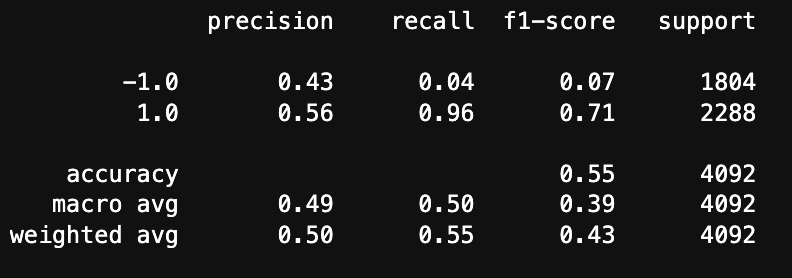
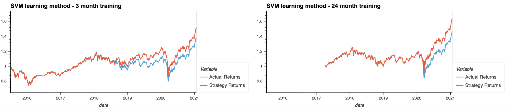
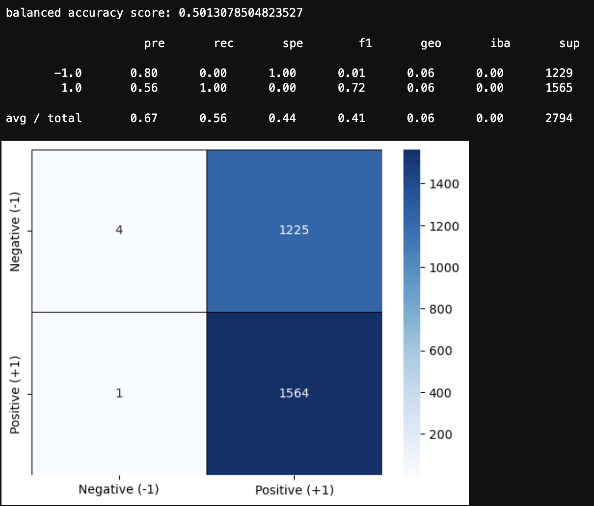
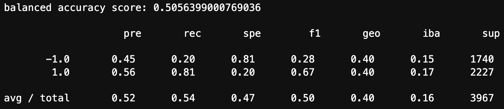
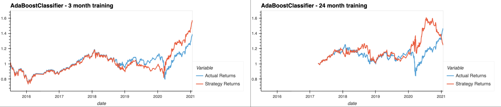

# **Columbia University Engineering, New York FinTech BootCamp** 
# **August 2022 Cohort**


## *Module 14, Challenge -  Data Science & Machine Learning - Algoritmic Trading, Supervised MachineLearning*
Objective - Compile and Evaluate a Binary Classification Model using a Neural Network that predicts if applicants will be successful if funded through venture capital firm. 

Scenario - Given a historical dataset CSV file containing more than 34,000 organizations that have received funding, employ neural network knowledge to evaluate dataset features and create a binary classifier model that will predict an applicant will become a successful or failed business.  

Product - Jupyter notebook with -

* > Data preprocessing for a neural network model.
* > binary classification model using a deep neural network.
* > Utilize model-fit-predict pattern to compile and evaluate.
* > Model optimization.

---
## **Methods**

### The code script analysis performed uses or employs applications of:

    Data encoding with OneHotEncoder, 
    train_test_split(),
    Feature Scaling with StandardScaler,
    keras.callbacks.EarlyStopping(),
    keras.callbacks.ModelCheckpoint(),

___
## Challenge - Modeling & Analysis
### Original 




___

## Challenge - Modeling & Analysis
### Optimization 













___


## Supplemental Modeling and Analysis

Supplemental processing and analysis:

Beyond the scope of the assignment, the author sought to conduct additional analysis of the data obtained; supplemental material script with model building follows the primary challenge. Additionally, supplemetal experimental notebooks are included.

---
## **Technologies**
---
### **Dependencies**

This project leverages Jupyter Lab v3.4.4 and Python version 3.9.13 packaged by conda-forge | (main, May 27 2022, 17:01:00) with the following packages:


* [sys](https://docs.python.org/3/library/sys.html) - module provides access to some variables used or maintained by the interpreter and to functions that interact strongly with the interpreter.

* [NumPy](https://numpy.org/doc/stable/user/absolute_beginners.html) - an open source Python library used for working with arrays, contains multidimensional array and matrix data structures with functions for working in domain of linear algebra, fourier transform, and matrices.

* [pandas](https://pandas.pydata.org/docs/) - software library written for the python programming language for data manipulation and analysis.

* [Path](https://pandas.pydata.org/docs/reference/api/pandas.concat.html) - from pathlib - Object-oriented filesystem paths, Path instantiates a concrete path for the platform the code is running on.

* [train_test_split](https://scikit-learn.org/stable/modules/generated/sklearn.model_selection.train_test_split.html) - from sklearn.model_selection, a quick utility that wraps input validation and next(ShuffleSplit().split(X, y)) and application to input data into a single call for splitting (and optionally subsampling) data in a oneliner.

* [OneHotEncoder](https://scikit-learn.org/stable/modules/generated/sklearn.preprocessing.OneHotEncoder.html) - from sklearn.preprocessing, encode categorical features as a one-hot numeric array. Features are encoded using a one-hot (aka ‘one-of-K’ or ‘dummy’) encoding scheme; creates a binary column for each category and returns a sparse matrix or dense array.

* [StandardScaler](https://scikit-learn.org/stable/modules/generated/sklearn.preprocessing.StandardScaler.html) - from sklearn.preprocessing, standardize features by removing the mean and scaling to unit variance.

* [matplotlib.pyplot](https://matplotlib.org/3.5.3/api/_as_gen/matplotlib.pyplot.html) a state-based interface to matplotlib. It provides an implicit, MATLAB-like, way of plotting. It also opens figures on your screen, and acts as the figure GUI manager

___

### **Hardware used for development**

MacBook Pro (16-inch, 2021)

    Chip Appple M1 Max
    macOS Monterey version 12.6

### **Development Software**

Homebrew 3.6.11

    Homebrew/homebrew-core (git revision 01c7234a8be; last commit 2022-11-15)
    Homebrew/homebrew-cask (git revision b177dd4992; last commit 2022-11-15)

Python Platform: macOS-13.0.1-arm64-arm-64bit

    Python version 3.9.13 packaged by conda-forge
    Scikit-Learn 1.1.3
    Tensor Flow Version: 2.10.0
    Keras Version: 2.10.0
    pandas 1.5.1

pip 22.3 from /opt/anaconda3/lib/python3.9/site-packages/pip (python 3.9)


git version 2.37.2

---
## *Installation of application (i.e. github clone)*

 In the terminal, navigate to directory where you want to install this application from the repository and enter the following command

```python
git clone git@github.com:Billie-LS/DeepL_Adventure_Angels.git
```

---
## **Usage**

From terminal, the installed application is run through jupyter lab web-based interactive development environment (IDE) interface by typing at prompt:

```python
> jupyter lab

```
The file you will run is:

```python
credit_risk_resampling.ipynb

```

___

## **Project requirements**
### see starter code

---
## **Version control**

Version control can be reviewed at:

```python
https://github.com/Billie-LS/DeepL_Adventure_Angels
```

[repository](https://github.com/Billie-LS/DeepL_Adventure_Angels)


___
## **Contributors**

### **Author**

Loki 'billie' Skylizard
    [LinkedIn](https://www.linkedin.com/in/l-s-6a0316244)
    [@GitHub](https://github.com/Billie-LS)


### **BootCamp lead instructor**

Vinicio De Sola
    [LinkedIn](https://www.linkedin.com/in/vinicio-desola-jr86/)
    [@GitHub](https://github.com/penpen86)


### **Outside instructors**
Jeff Heaton
    [LinkedIn](https://www.linkedin.com/in/jeffheaton/)
    [@GitHub](https://github.com/jeffheaton/t81_558_deep_learning/blob/master/install/tensorflow-install-conda-mac-metal-jul-2022.ipynb)
    [YouTube](https://www.youtube.com/watch?v=5DgWvU0p2bk)


### **BootCamp teaching assistant**

Santiago Pedemonte
    [LinkedIn](https://www.linkedin.com/in/s-pedemonte/)
    [@GitHub](https://github.com/Santiago-Pedemonte)


### **BootCamp classmates**

None

### **askBCS assistants**

None


___

### **Additional references and or resources utilized**

[Keras](https://keras.io/guides/keras_tuner/getting_started/)

[Keras](https://keras.io/api/callbacks/model_checkpoint/)

[pandas](https://pandas.pydata.org/docs/reference/api/pandas.DataFrame.values.html)

[pandas](https://pandas.pydata.org/docs/reference/api/pandas.DataFrame.to_numpy.html#pandas.DataFrame.to_numpy)

[PredictiveHacks](https://predictivehacks.com/how-to-prevent-overfitting-in-neural-networks-with-tensorflow-2-0/)

[Stack Overflow](https://stackoverflow.com/questions/51731207/python-neural-network-typeerror-history-object-is-not-subscriptable)

[Stack Overflow](https://stackoverflow.com/questions/51293196/attributeerror-numpy-ndarray-object-has-no-attribute-drop)

[Stack Overflow](https://stackoverflow.com/questions/61742556/valueerror-shapes-none-1-and-none-2-are-incompatible)

[PredictiveHacks](https://predictivehacks.com/how-to-prevent-overfitting-in-neural-networks-with-tensorflow-2-0/)

[TensorFlow](https://www.tensorflow.org/api_docs/python/tf/train/Checkpoint#restorefor)

[TensorFlow](https://www.tensorflow.org/api_docs/python/tf/keras/activations)


[GitHub](https://github.com/christianversloot/machine-learning-articles/blob/main/automating-neural-network-configuration-with-keras-tuner.md)

[GitHub](https://github.com/christianversloot/machine-learning-articles/blob/main/automating-neural-network-configuration-with-keras-tuner.md)

[GitHub](https://github.com/kirpa1986/FinTech-Projects/tree/0f516333ff7acadfd6f63e7c3069dd72f9da5095/Module%2013%20Challenge%20-%20Venture%20Funding%20with%20Deep%20Learning)


[Stack Overflow](https://)

[Stack Overflow](https://)

*For something other analysis-*
[GitHub](https://)

___
## **License**

MIT License

Copyright (c) [2022] [Loki 'billie' Skylizard]

Permission is hereby granted, free of charge, to any person obtaining a copy
of this software and associated documentation files (the "Software"), to deal
in the Software without restriction, including without limitation the rights
to use, copy, modify, merge, publish, distribute, sublicense, and/or sell
copies of the Software, and to permit persons to whom the Software is
furnished to do so, subject to the following conditions:

The above copyright notice and this permission notice shall be included in all
copies or substantial portions of the Software.

THE SOFTWARE IS PROVIDED "AS IS", WITHOUT WARRANTY OF ANY KIND, EXPRESS OR
IMPLIED, INCLUDING BUT NOT LIMITED TO THE WARRANTIES OF MERCHANTABILITY,
FITNESS FOR A PARTICULAR PURPOSE AND NONINFRINGEMENT. IN NO EVENT SHALL THE
AUTHORS OR COPYRIGHT HOLDERS BE LIABLE FOR ANY CLAIM, DAMAGES OR OTHER
LIABILITY, WHETHER IN AN ACTION OF CONTRACT, TORT OR OTHERWISE, ARISING FROM,
OUT OF OR IN CONNECTION WITH THE SOFTWARE OR THE USE OR OTHER DEALINGS IN THE
SOFTWARE.


