# **Columbia University Engineering, New York FinTech BootCamp** 
# **August 2022 Cohort**


## *Module 14, Challenge -  Data Science & Machine Learning - Algorithmic Trading, Supervised MachineLearning*
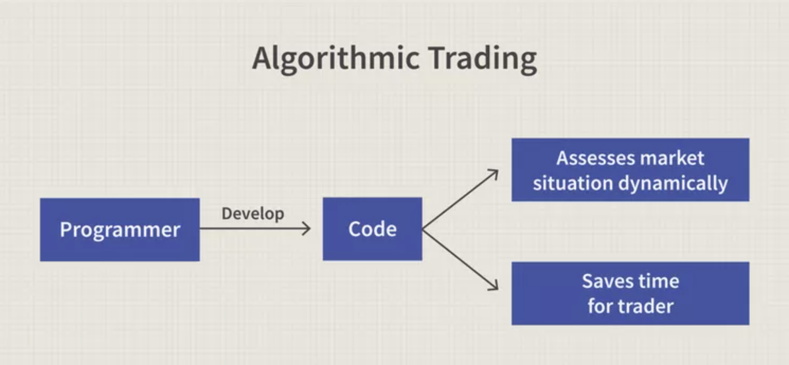
___
# **REPORT**
## Baseline - support vector machine (SVM) learning method
* > 3 months training data vs 24 months training data
* > short window = 4, long window = 100

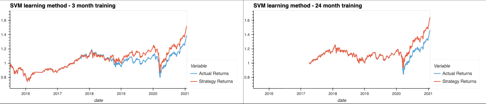
### Metrics

* > 3 months training data

Classification report
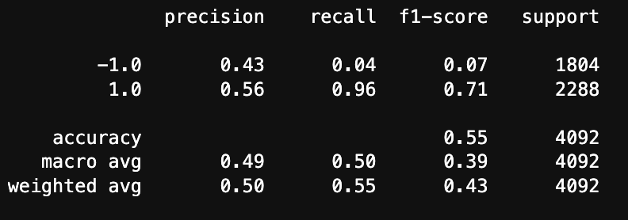
classification report imbalanced
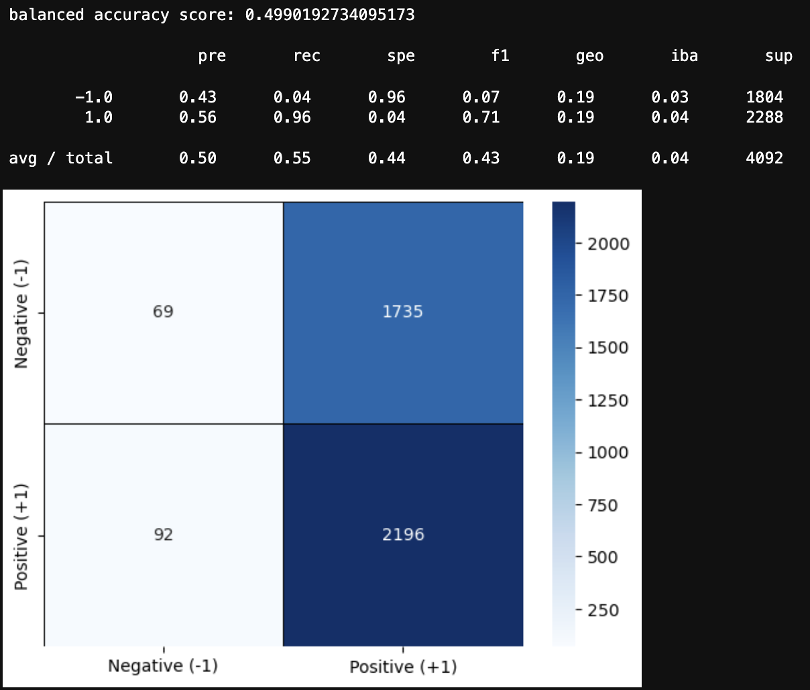
___

* > 24 months training data

Classification report

classification report imbalanced
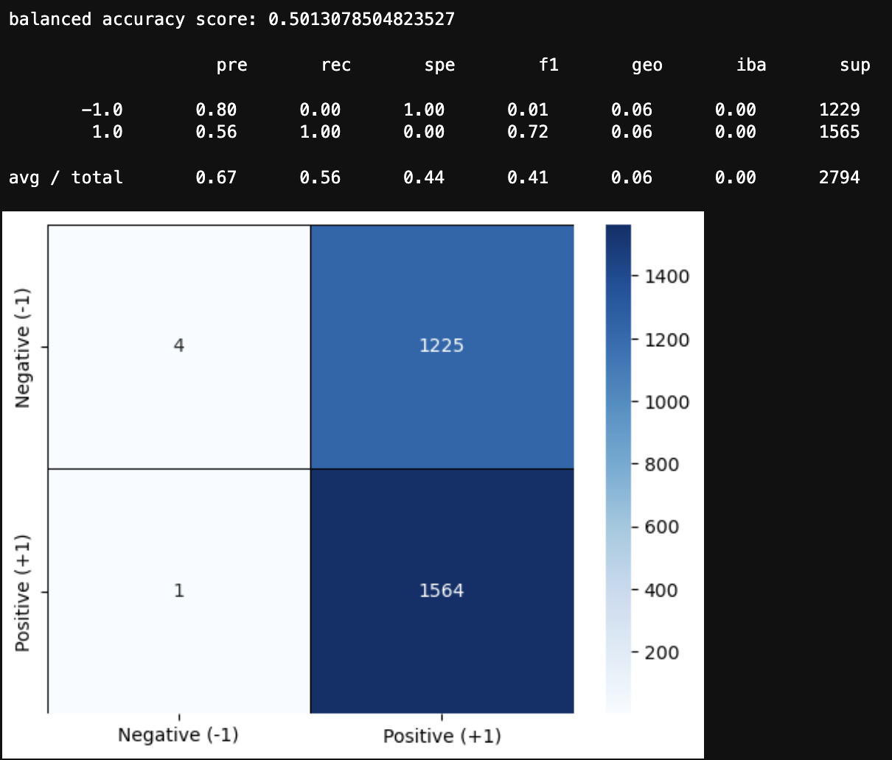
___

## Adjusted Baseline - support vector machine (SVM) learning method
* > 3 months training data vs 24 months training data
* > short window = 50, long window = 200 (traditional 'daily settings')

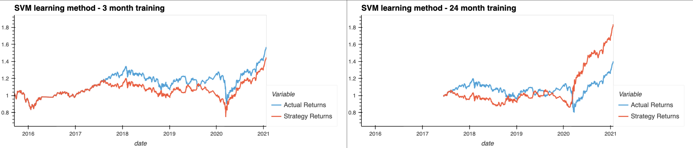
### Metrics

* > 3 months training data

Classification report
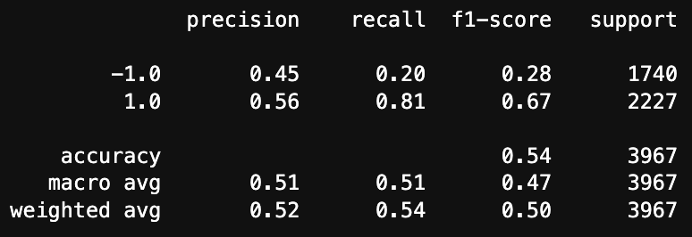
classification report imbalanced
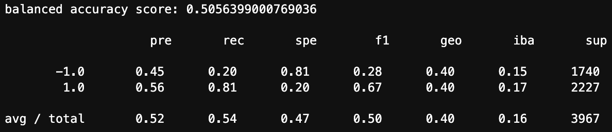
___

* > 24 months training data

Classification report

classification report imbalanced
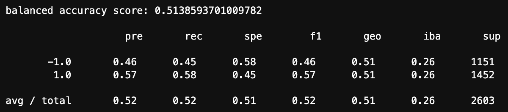

___
___

## Baseline - AdaBoostClassifier method
* > 3 months training data vs 24 months training data
* > short window = 4, long window = 100

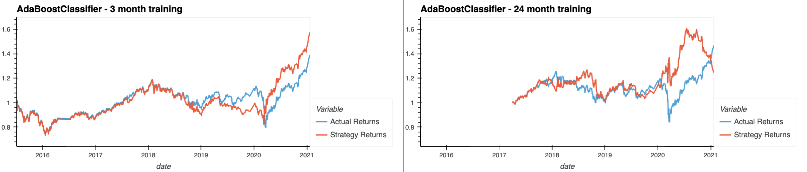
### Metrics

* > 3 months training data

Classification report
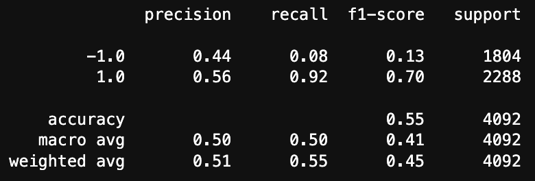
classification report imbalanced
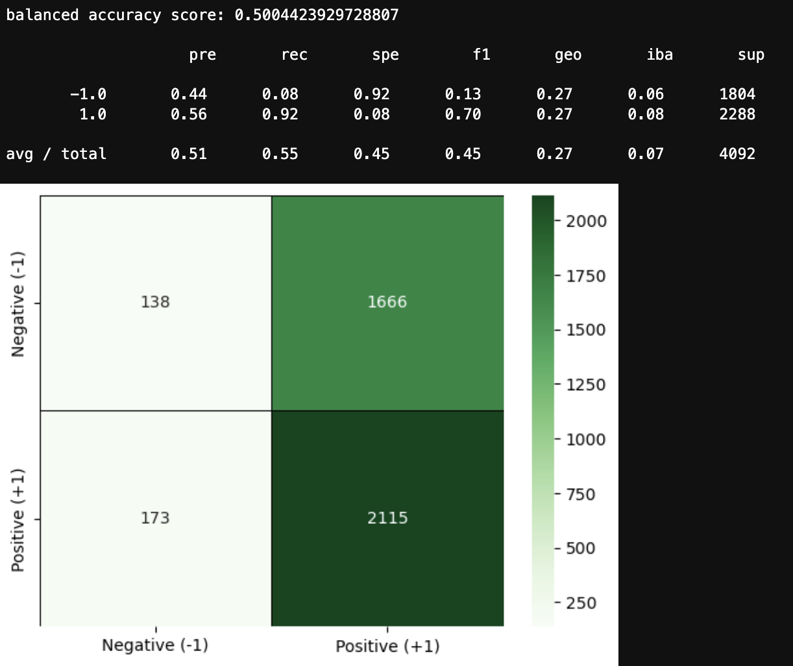
___

* > 24 months training data

Classification report
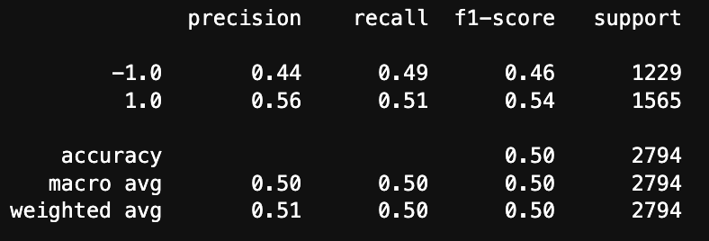
classification report imbalanced
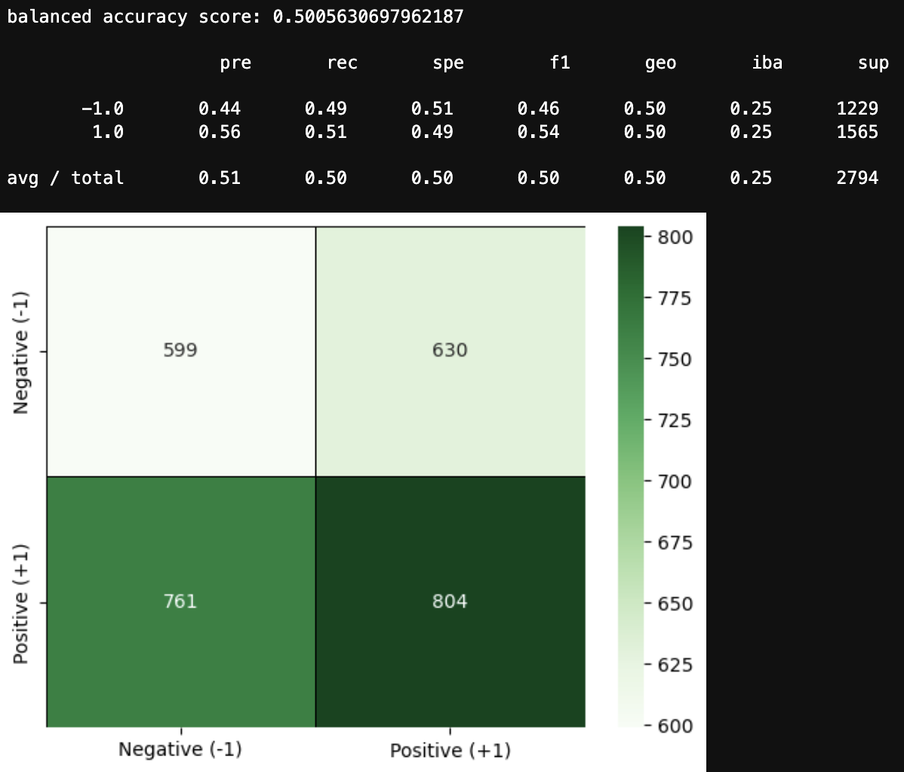
___

## Adjusted Baseline - AdaBoostClassifier method
* > 3 months training data vs 24 months training data
* > short window = 50, long window = 200 (traditional 'daily settings')

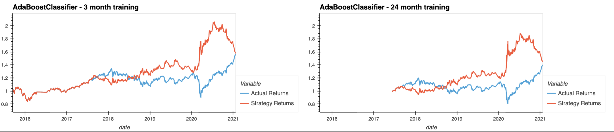
### Metrics

* > 3 months training data

Classification report
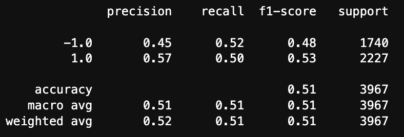
classification report imbalanced
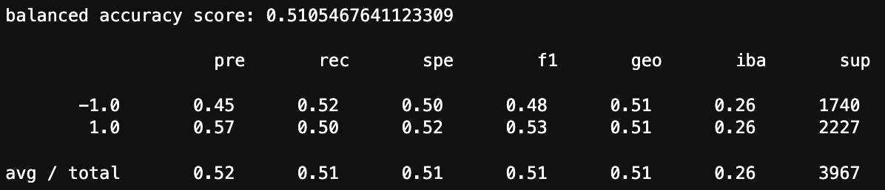
___

* > 24 months training data

Classification report
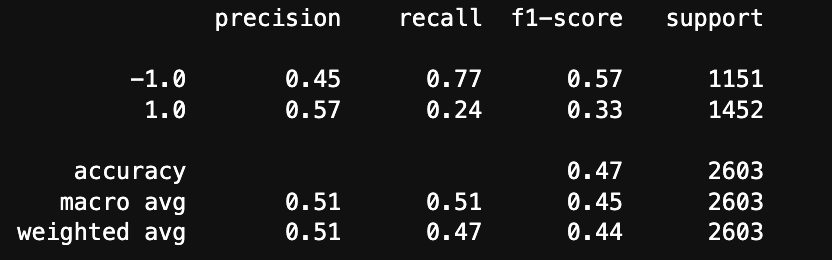
classification report imbalanced
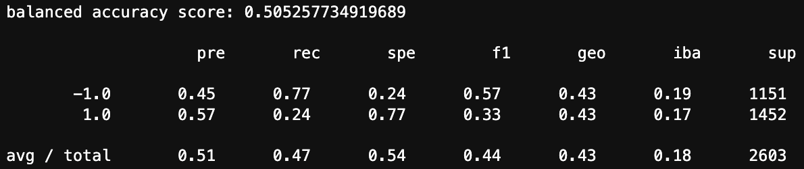

___
___

## Baseline - LogisticRegression method
* > 3 months training data vs 24 months training data
* > short window = 4, long window = 100

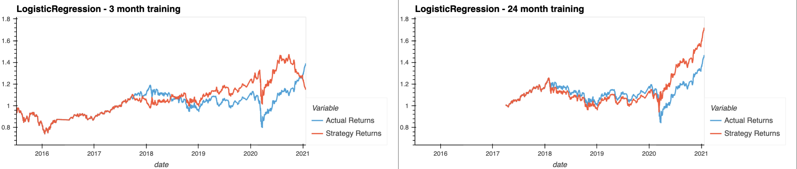
### Metrics

* > 3 months training data

Classification report

classification report imbalanced
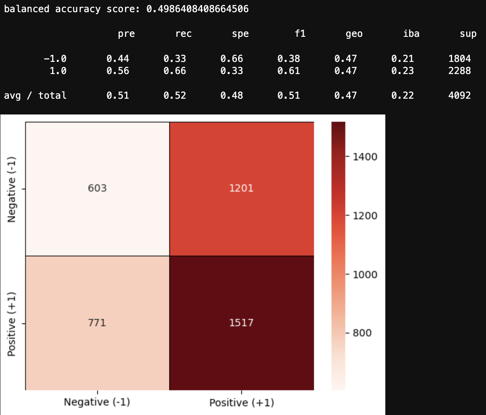
___

* > 24 months training data

Classification report
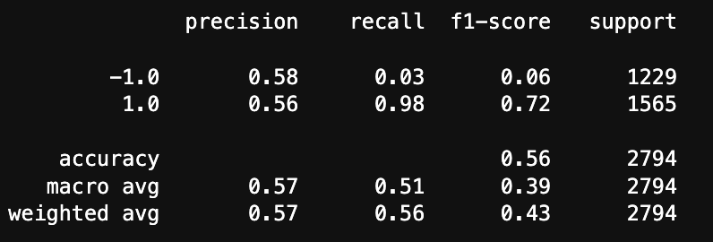
classification report imbalanced
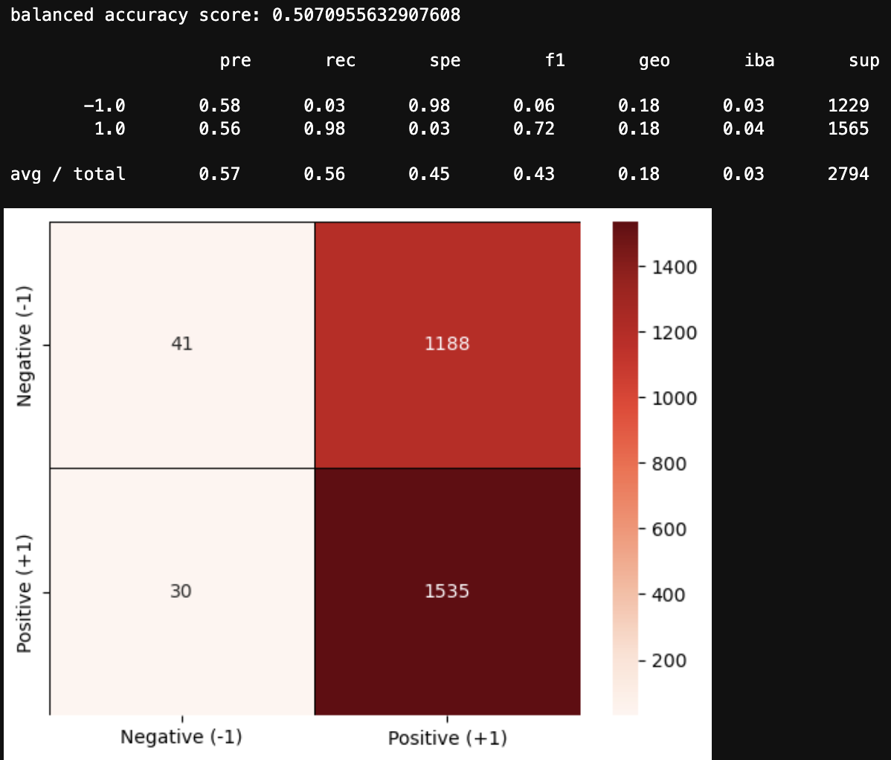
___

## Adjusted Baseline - LogisticRegression method
* > 3 months training data vs 24 months training data
* > short window = 50, long window = 200 (traditional 'daily settings')

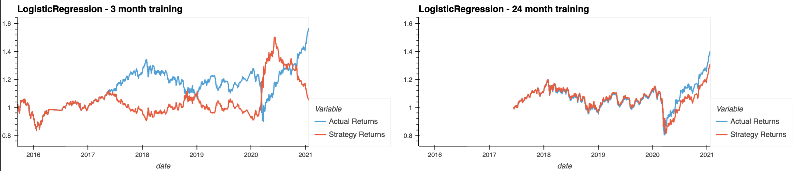
### Metrics

* > 3 months training data

Classification report
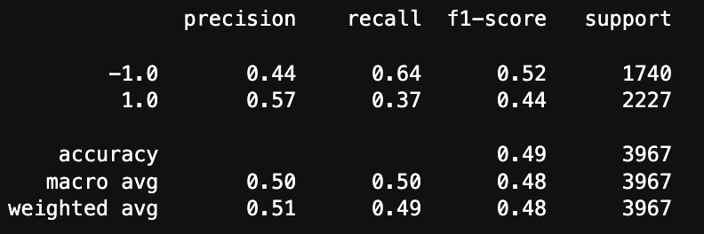
classification report imbalanced
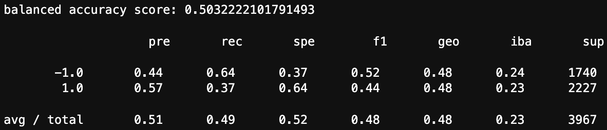
___

* > 24 months training data

Classification report
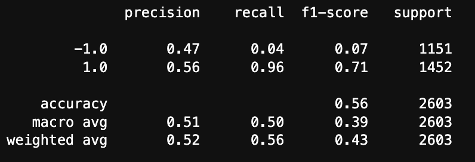
classification report imbalanced
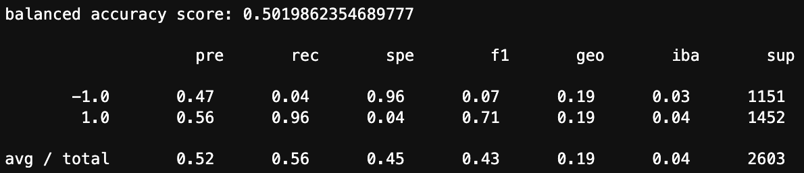

___
# **SUMMARY FINDINGS**

Training Dataset Adjustment, SMA adjustment, and aditional model testing

* **baseline algorithm** with 3 month training data demonstrated ~52% cumulative return on testing by chart, i.e. BETTER than actual
* **baseline algorithm** with 24 months training data demonstrated ~64.6% cumulative return on testing by chart, i.e. BETTER than 3 month and better than actual

* **baseline algorithm** with 3 month training data with adjusted SMA to 50 / 200 demonstrated ~44.7% cumulative return on testing by chart, i.e. WORSE than actual
* **baseline algorithm** with 24 months training data with adjusted SMA to 50 / 200 demonstrated ~83.5% cumulative return on testing by chart, i.e. BETTER than 3 month, BETTER than actual, and **BEST overall performance** compared to all others

* **AdaBoostClassifier method** 3 month training data demonstrated ~57.4% cumulative return on testing by chart, i.e. BETTER than baseline algorithm, BETTER than actual
* **AdaBoostClassifier method** 24 months training data demonstrated ~24.6% cumulative return on testing by chart, i.e. WORSE than baseline algorithm, WORSE than 3 month and WORSE than actual

* **AdaBoostClassifier method** with 3 month training data with adjusted SMA to 50 / 200 demonstrated ~59.3% cumulative return on testing by chart, i.e. BETTER than baseline algorithm, BETTER than SMA 4 / 100, BETTER than actual
* **AdaBoostClassifier method** with 24 months training data with adjusted SMA to 50 / 200 demonstrated ~44.3% cumulative return on testing by chart, i.e. WORSE than baseline algorithm, BETTER than SMA 4 / 100, BETTER than actual

* **LogisticRegression method** 3 month training data demonstrated ~14.7% cumulative return on testing by chart, i.e. WORSE than baseline algorithm, WORSE than AdaBoostClassifier method, WORSE than actual
* **LogisticRegression method** 24 months training data demonstrated ~71.9% cumulative return on testing by chart, i.e. BETTER than baseline algorithm, BETTER than AdaBoostClassifier method, BETTER than 3 month, BETTER than actual, and SECOND BEST overall performance** compared to all others

* **LogisticRegression method** with 3 month training data with adjusted SMA to 50 / 200 demonstrated ~5.1% cumulative return on testing by chart, i.e. WORSE than baseline algorithm, WORSE than AdaBoostClassifier method, WORSE than SMA 4 / 100, WORSE than actual, and **WORST overall performance** compared to all others
* **LogisticRegression method** with 24 months training data with adjusted SMA to 50 / 200 demonstrated ~30% cumulative return on testing by chart, i.e. WORSE than baseline algorithm, WORSE than SMA 4 / 100, WORSE than actual

___
# **CONCLUSION**
The best performance based on the cumulative returns graph was the SVM algorithm using 24 months training dataset and SMA of 50 / 200.  The final cumulative return demonstrated was ~83.5%

The second best performance based on the cumulative returns graph was the LogisticRegression method using 24 months training dataset and SMA of 4 / 100.  The final cumulative return demonstrated was ~71.9%

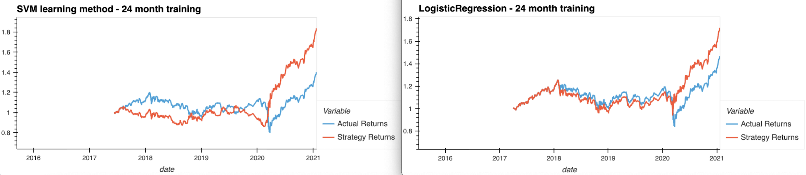

___
## **Technologies**
___

### **Hardware used for development**

MacBook Pro (16-inch, 2021)

    Chip Appple M1 Max
    macOS Venture version 13.0.1

### **Development Software**

Homebrew 3.6.11

    Homebrew/homebrew-core (git revision 01c7234a8be; last commit 2022-11-15)
    Homebrew/homebrew-cask (git revision b177dd4992; last commit 2022-11-15)

Python Platform: macOS-13.0.1-arm64-arm-64bit

    Python version 3.9.15 packaged by conda-forge | (main, Nov 22 2022, 08:52:10)
    Scikit-Learn 1.1.3
    pandas 1.5.1
    Numpy 1.21.5

pip 22.3 from /opt/anaconda3/lib/python3.9/site-packages/pip (python 3.9)


git version 2.37.2

---
## *for Installation of application and usage*

Go to repository

[repository](https://github.com/Billie-LS/Algo_da_trader)

Review file 

```python
README.md

```
___
## **Contributors**

### **Author**

Loki 'billie' Skylizard
    [LinkedIn](https://www.linkedin.com/in/l-s-6a0316244)
    [@GitHub](https://github.com/Billie-LS)


### **BootCamp lead instructor**

Vinicio De Sola
    [LinkedIn](https://www.linkedin.com/in/vinicio-desola-jr86/)
    [@GitHub](https://github.com/penpen86)

### **BootCamp teaching assistant**

Santiago Pedemonte
    [LinkedIn](https://www.linkedin.com/in/s-pedemonte/)
    [@GitHub](https://github.com/Santiago-Pedemonte)

___

### **Additional references and or resources utilized**

[GitHub](https://github.com/Billie-LS/DeepL_Adventure_Angels)
___


___
## **License**

MIT License

Copyright (c) [2022] [Loki 'billie' Skylizard]

Permission is hereby granted, free of charge, to any person obtaining a copy
of this software and associated documentation files (the "Software"), to deal
in the Software without restriction, including without limitation the rights
to use, copy, modify, merge, publish, distribute, sublicense, and/or sell
copies of the Software, and to permit persons to whom the Software is
furnished to do so, subject to the following conditions:

The above copyright notice and this permission notice shall be included in all
copies or substantial portions of the Software.

THE SOFTWARE IS PROVIDED "AS IS", WITHOUT WARRANTY OF ANY KIND, EXPRESS OR
IMPLIED, INCLUDING BUT NOT LIMITED TO THE WARRANTIES OF MERCHANTABILITY,
FITNESS FOR A PARTICULAR PURPOSE AND NONINFRINGEMENT. IN NO EVENT SHALL THE
AUTHORS OR COPYRIGHT HOLDERS BE LIABLE FOR ANY CLAIM, DAMAGES OR OTHER
LIABILITY, WHETHER IN AN ACTION OF CONTRACT, TORT OR OTHERWISE, ARISING FROM,
OUT OF OR IN CONNECTION WITH THE SOFTWARE OR THE USE OR OTHER DEALINGS IN THE
SOFTWARE.


